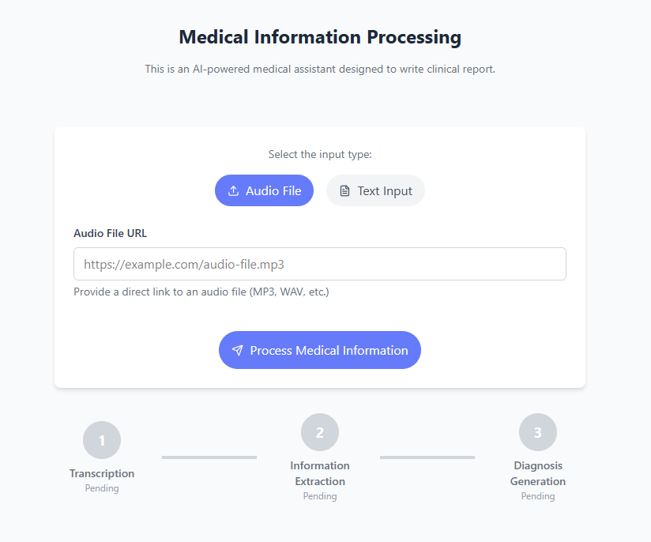
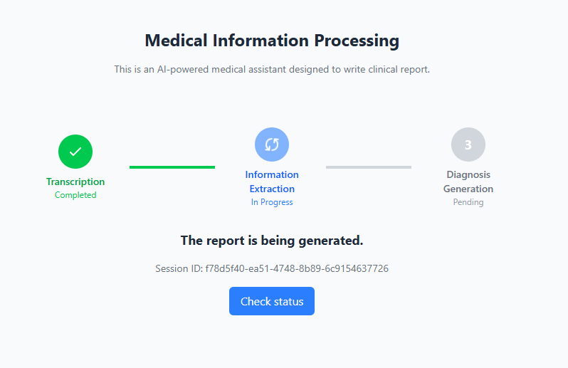
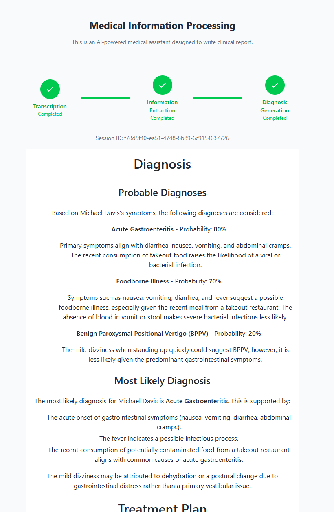

# Telepatia - AI Medical Assistant

A functional web application that processes audio or text inputs via Firebase Cloud Functions integrated with language models (LLMs), returning structured medical information.


## Project Overview

This application provides:
- **Audio Transcription**: Convert audio files to text using speech-to-text APIs
- **Medical Information Extraction**: Extract symptoms, patient info, and visit reasons using LLMs
- **Diagnosis Generation**: Generate medical diagnoses and treatment plans
- **Real-time UI**: React-based frontend with real-time updates and visualizations

## Setup Video

Watch this tutorial on how to setup the project:

[](https://youtu.be/ldUQ6iHqWmU?si=AdU2jTSSqOXnPHT3)

*Click the image above to watch the full demo video*

## Application Screenshots

### Initial Interface


### Processing State


### Results Display



## Architecture

- **Frontend**: React + TypeScript + Vite + Tailwind CSS
- **Backend**: Firebase Cloud Functions (Python) with chained processing
- **Database**: Firestore for intermediate state management
- **AI Integration**: OpenAI API for LLM processing

## Prerequisites

- Node.js (v18 or higher)
- Python 3.13
- Firebase CLI
- Git

## Quick Start

### 1. Clone the Repository

```bash
git clone <repository-url>
cd challenge-telepatia
```

### 2. Backend Setup

#### Install Firebase CLI (if not already installed)
```bash
npm install -g firebase-tools
```

#### Navigate to Backend Directory
```bash
cd backend
```

#### Set Up Environment Variables

Create `.env` file with the following variables:
```env
OPENAI_API_KEY=your_openai_api_key_here
FIREBASE_PROJECT_ID=your_firebase_project_id
```

#### Set Up Python Environment
```bash
# Create virtual environment
python -m venv .venv

# Activate virtual environment
# On Windows:
.venv\Scripts\activate
# On macOS/Linux:
source .venv/bin/activate

# Upgrade pip (if needed)
python -m pip install --upgrade pip

# Install dependencies
pip install -r requirements.txt
```

#### Initialize Firebase
```bash
# Login to Firebase
firebase login

# Initialize Firebase project
firebase init

# Select the following options:
# - Use an existing project (or create new)
# - Select Firestore and Functions
# - Choose Python runtime
# - Install dependencies with pip
```

#### Start Firebase Emulators (for local development)
```bash
firebase emulators:start
```

The backend will be available at `http://127.0.0.1:5001/telepatia-challenge/us-central1`

### 3. Frontend Setup

#### Navigate to Frontend Directory
```bash
cd ../../frontend
```

#### Install Dependencies
```bash
# Using npm
npm install

# Or using pnpm (recommended)
pnpm install
```

#### Set Up Environment Variables
Create a `.env` file in the `frontend/` directory:

```env
VITE_API_URL=http://127.0.0.1:5001/telepatia-challenge/us-central1
```

#### Start Development Server
```bash
npm run dev
# Or
pnpm dev
```

The frontend will be available at `http://localhost:5173`

## Testing the Application

### Audio Test File
Use the provided audio file for testing:
- **URL**: https://shared-files-repo.s3.us-east-1.amazonaws.com/doctor_appointment.mp3

### Testing Workflow
1. Open the frontend application
2. Upload the audio file or enter text manually
3. Monitor the processing through the UI
4. View the generated medical information and diagnosis

## API Endpoints

The backend provides the following endpoints:

- `POST /transcription_handler` - Process audio transcription
- `POST /information_extractor_handler` - Extract medical information
- `POST /diagnosis_generation_handler` - Generate diagnosis
- `GET /get_transcription` - Get transcription status
- `GET /get_clinical_record` - Get clinical records

## Troubleshooting

### Common Issues

1. **Pip upgrade error**: Run `python -m pip install --upgrade pip` before installing requirements
2. **Firebase CLI not found**: Install with `npm install -g firebase-tools`
3. **Port conflicts**: Check if ports 5001 (Firebase) and 5173 (Frontend) are available
4. **Environment variables**: Ensure all required .env files are created with correct values

### Debug Mode
```bash
# Backend debug logs
firebase emulators:start --debug

# Frontend debug
npm run dev -- --debug
```
